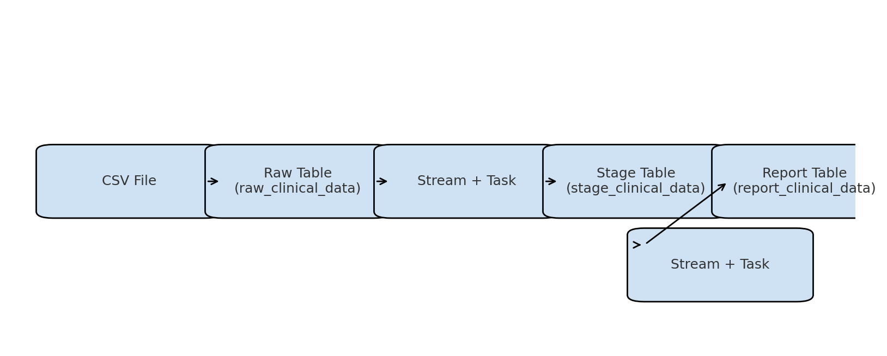

# 🧬 Clinical Data Pipeline Project

This project is an end-to-end **data engineering pipeline** built using **Python**, **Snowflake**, and **SQL** to process and analyze clinical trial data. 
It demonstrates how to move raw patient data from CSV to a structured reporting layer using automated data streams and tasks.

---

##  Technologies Used

- ❄️ Snowflake (Data Warehouse)
- 🐍 Python
- 🧮 SQL (for transformations)
- 📦 Streams & Tasks (for automation)
- 📊 Pandas (for data manipulation)

---

##  Architecture Overview

- Raw data is loaded from a `.csv` file into the `raw_clinical_data` table
- BMI and Risk Level are calculated in `stage_clinical_data`
- Cleaned and enriched data is moved to `report_clinical_data` using Snowflake Tasks

---

## 📊 Pipeline Diagram

This diagram shows the flow from raw data ingestion to reporting.

##  Project Structure

##  Features

- ✅ Clean data layer separation: Raw → Stage → Report
- ✅ BMI calculation and Risk classification in SQL
- ✅ Automated transformations with Streams & Tasks
- ✅ Real-world ELT pipeline (not just static scripts)

---

##  How to Run

### 1. Prepare Snowflake
- Run `clinical_pipeline.sql` in Snowflake to set up:
  - Raw, Stage, Report tables
  - Streams and Tasks

### 2. Load Raw Data

- python scripts/load-to-snowflake.py
